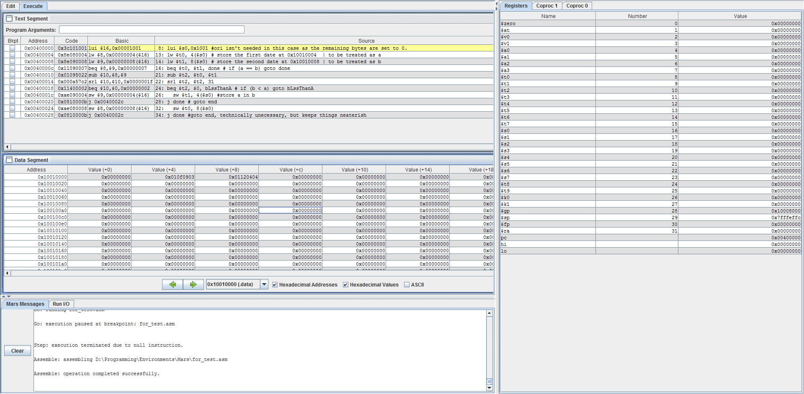
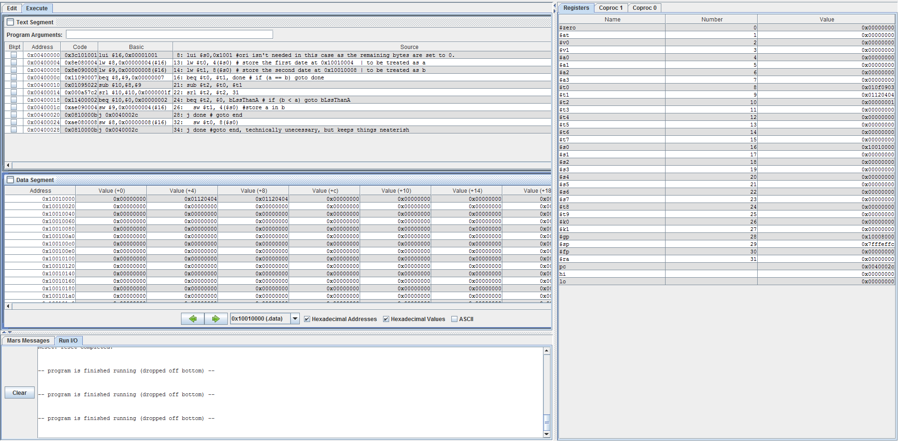

Write a commented MIPS assembly language program to do the following:

Compare two dates stored in predefined addresses in memory.
Overwrite the earlier date with the later date.
For example, if the two dates in memoryh when the program begins are January 15, 1999 and September 3, 2015, then when the program ends both memory locations will hold the date September 3, 2015.

Dates are stored in the following 4 byte format:

* MSB (aka byte 3) holds the value 0 if the date is in the twentieth century (19xx) or the value 1 if the date is in the twenty first century (20xx).
* Byte 2 holds the year within the century (in the range 0 to 99 decimal) coded as a binary number.
* Byte 1 holds the month (in the range 1 to 12 decimal) coded as a binary number
* Byte 0 (LSB) holds the day of the month (in the range 1 to 31 decimal) coded as a binary number.

Example: September 3, 2015

MSB = 1 = 0x01
Byte 2 = 15 = 0x0F
Byte 1 = 9 = 0x09
Byte 0 (LSB) = 3 = 0x03

Word contents 0x010F0903.

No error checking for valid dates is needed; your program may assume dates are valid.

Do not use "pseudoinstructions"/extended instruction set.

The memory addresses for the two dates should be "Hard coded" in the program.
The two dates should be hand-entered in the simulator.

