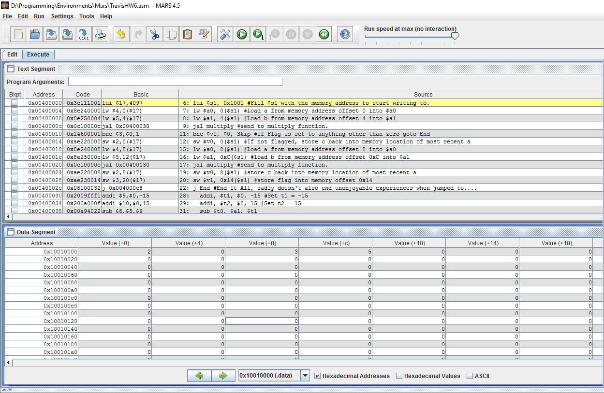
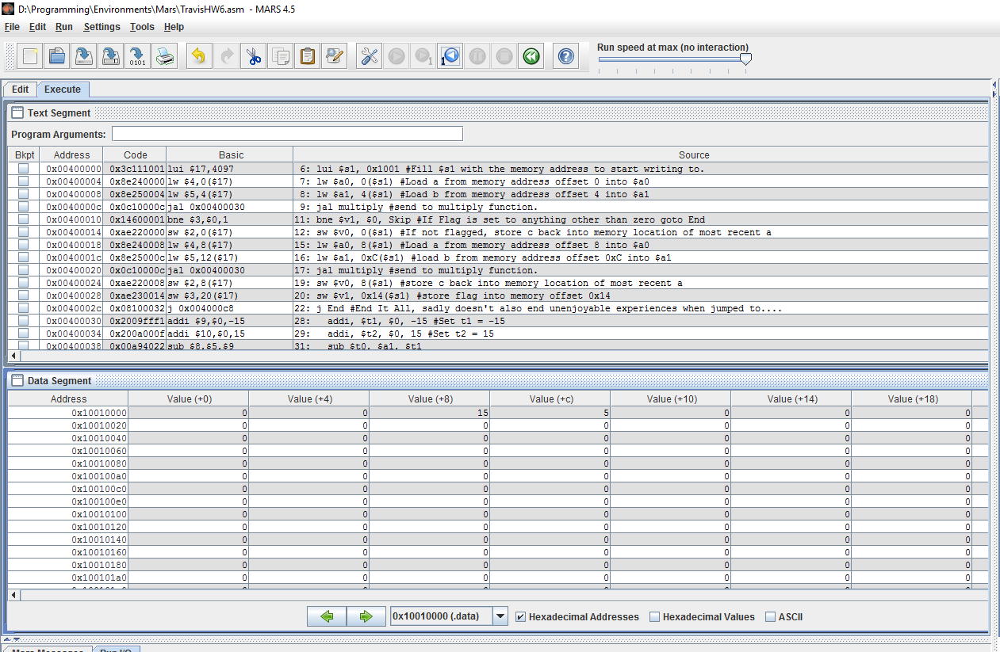

Use a function called "multiply" (defined below) to do the following:

Multiply the value in memory address 0x10010000 by the value in memory address 0x10010004.
If the multiply function returns a flag value of zero, then store the returned product in memory address 0x10010000; otherwise do not store the returned product (leave memory address 0x10010000 at its original value).

Multiply the value in memory address 0x10010008 by the value in memory address 0x1001000C.
Store the returned product in memory address 0x10010010 and returned flag in memory address 0x10010014.

Function "multiply" takes two 32-bit twos compliment arugments A and B, and returns two 32-bit two's compliment outputs 'product' and 'flag'.
Argument A can have any value in the range of 32-bit two's compliment integers.
If argument B is in the range -15 to 15 (base ten) inclusive (meaning -15 <= B <= 15), the function returns the value of (A * B) as its first return value "product" and zero as it's second return value "flag".

If Argument B is out of range (meaning B < -15 || B > 15), the function returns product equal to zero and flag equal to 1.

Overflow can be ignored (id est, if (A * B) is outside the range of 32-bit two's compliment integers, it is okay that the multiplication overflowed and the 32-bit result cannot hold the correct value).

Do _not_ use the "mul" or "mult" instructions.
Do not use "pseudoinstructions"/extended instruction set.

Before executing your program, you will use the simulator to put values into the memory addresses 0x10010000, 0x10010004, 0x10010008, and 0x1001000C.

